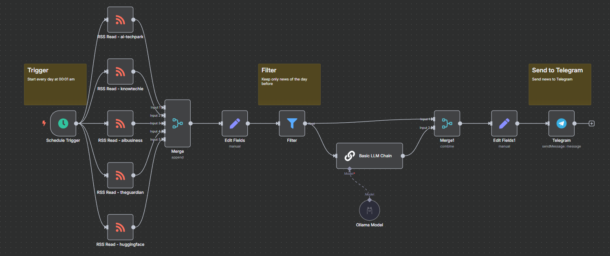
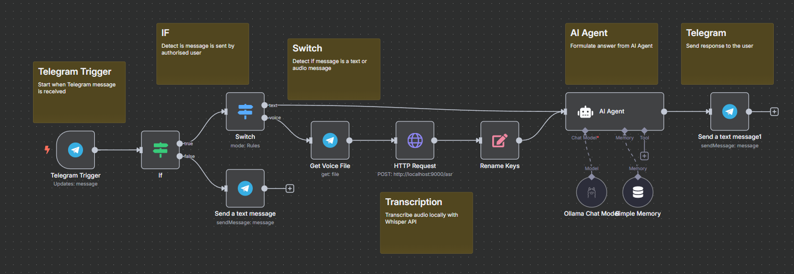
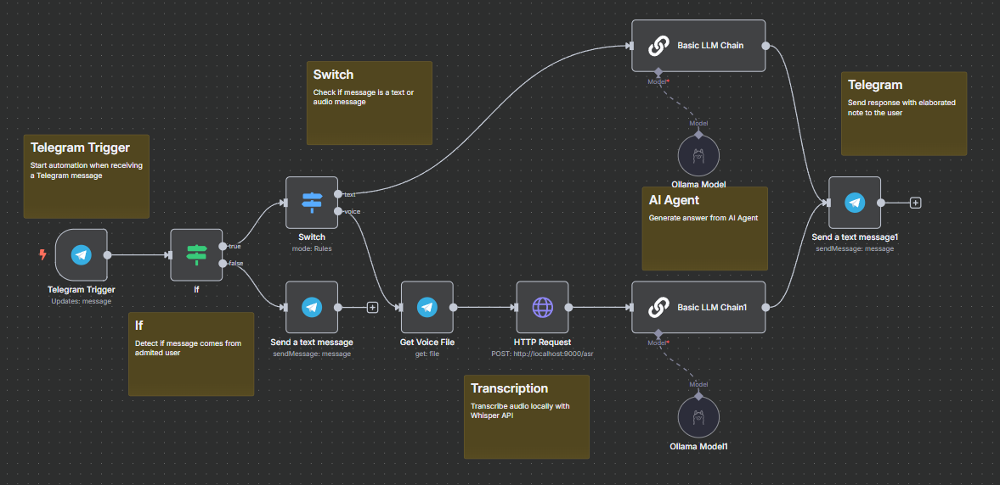

# n8n_AI-automations
# 🧠 Local AI Agents on Raspberry Pi 5

This project consists of **three powerful AI Agents** running **locally** on a **Raspberry Pi 5** using **only free and open-source tools**. These agents are integrated with Telegram, Ollama, Whisper, and Llama 3.2, enabling full functionality **without any paid APIs or cloud dependencies**.

---

## ⚙️ Technologies Used

- **🧠 Ollama** – Runs LLMs like LLaMA 3.2 locally.
- **🗣️ Whisper (via faster-whisper)** – Transcribes voice messages from Telegram.
- **📱 Telegram Bots** – Interface for interacting with the agents.
- **🐧 Raspberry Pi 5** – Entire pipeline runs efficiently on this small, local device.

---

## 🤖 Available Agents

### 1. 📰 AIDailyNews
- Gathers and summarizes every day at 00:01 am the latest AI news of the day before.
- Automatically scrapes content from selected sites or channels.
- Sends summarized updates directly to your Telegram inbox.
- Ideal for AI-curated daily briefings.

### 2. 🧑‍💼 PersonalAssistant
- Acts as a general-purpose chatbot and productivity assistant.
- Handles questions, reminders, and routine tasks via Telegram.
- Uses a local LLM for reasoning and replies.

### 3. 📝 PersonalNotesAssistant
- Converts voice or text messages into clean, summarized notes.
- Uses Whisper for transcription and LLM for summarization.
- Organizes the notes and sends them back in Telegram-ready format.
- [https://n8n.io/workflows/6013-create-personal-notes-with-voice-transcription-using-local-llama-and-telegram/](https://n8n.io/workflows/6013-create-personal-notes-with-voice-transcription-using-local-llama-and-telegram/)

---

## 🛠️ Key Features

- ✅ **Fully Offline Capable** – No cloud dependencies.
- ✅ **Runs on Raspberry Pi 5** – Optimized for local edge devices.
- ✅ **Free & Open-Source Stack** – No API keys, no subscriptions.
- ✅ **Privacy-Friendly** – Your data stays on your own device.
- ✅ **Multi-Agent Architecture** – Separate workflows for each agent.
- ✅ **Automation-Ready** – Plug-and-play with your Telegram account.

---

## 🧪 Status

These workflows are fully functional and **used daily** on a Raspberry Pi 5.  
They are stable, lightweight, and perfect for local-first automation fans.

---

## 📸 Screenshots
**AIDailyNews**

**PersonalAssistant**

**PersonalNotesAssistant**

---

## 📦 Future Improvements

- Add a web dashboard for easier config/monitoring.
- Plug into Home Assistant or Tasker.
- Add more agents (e.g. calendar sync, health tracking).

---

## 🚀 Get Started

Want to build your own offline assistant?  
Check the code, run the workflows, and connect your own Telegram bot!

> No cloud, no cost — just powerful personal AI at home.
